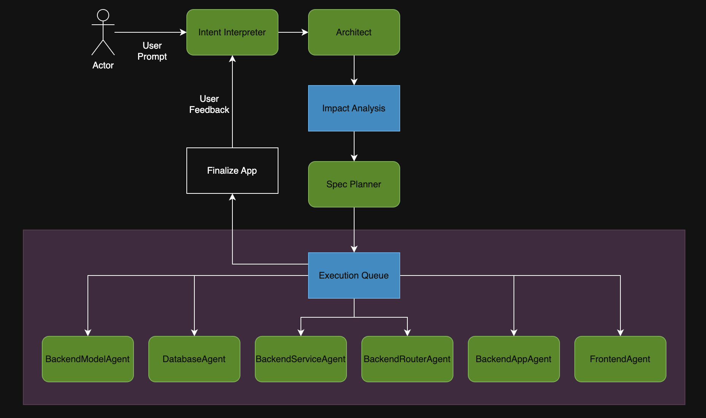

# AI-Powered Application Builder

## Overview

This project is an AI-powered application builder that automatically generates full-stack applications from natural language descriptions. The system uses a multi-agent architecture to interpret user intent, plan the application structure, and generate production-ready code for both backend and frontend components.

**Goal**: To demonstrate an end-to-end system that can take a user's natural language description and produce a working application with minimal human intervention, showcasing the capabilities of AI agents working in coordination through a structured workflow.

## Setup and Installation

This project uses **UV** as the package manager. Follow these steps to get started:

### Prerequisites
- Python 3.13 or higher
- UV package manager

### Installation Steps

1. **Install UV** (if not already installed):
   ```bash
   curl -LsSf https://astral.sh/uv/install.sh | sh
   ```

2. **Clone the repository**:
   ```bash
   git clone <repository-url>
   cd app-builder
   ```

3. **Install dependencies using UV**:
   ```bash
   uv sync
   ```

4. **Set up environment variables**:
   Create a `.env` file in the root directory with your OpenAI API key:
   ```env
   OPENAI_API_KEY=your_openai_api_key
   ```

5. **Run the application**:
   ```bash
   uv run python main.py
   ```

## System Components



The system consists of several specialized agents that work together in a sequential workflow:

### 1. Intent Interpreter

**Purpose**: Translates natural language user input into a structured intent specification that defines what the application should do.

**Output Structure**:
```json
{
  "app_summary": "A simple task management application with basic CRUD capabilities",
  "app_category": "crud_app",
  "primary_entities": {
    "Task": {
      "description": "A task with a title and description",
      "fields": {
        "title": {"type": "string", "required": true},
        "description": {"type": "string", "required": false}
      }
    }
  },
  "operations": {
    "Task": ["create", "read", "update", "delete"]
  },
  "ui_expectations": {
    "complexity": "basic",
    "interaction_style": "form_and_list"
  },
  "assumptions": ["Local execution", "Single-user application"],
  "non_goals": ["No multi-user features"]
}
```

### 2. Architect Agent

**Purpose**: Converts the intent specification into an executable architecture plan, defining the technology stack and execution layers with their dependencies.

**Output Structure**:
```json
{
  "architecture_version": "1.0",
  "tech_stack": {
    "backend": "fastapi",
    "frontend": "streamlit"
  },
  "execution_layers": [
    {
      "id": "backend_models",
      "type": "code_generation",
      "generator": "BackendModelAgent",
      "path": "backend/models",
      "depends_on": []
    },
    {
      "id": "database",
      "type": "code_generation",
      "generator": "DatabaseAgent",
      "path": "backend/db",
      "depends_on": ["backend_models"]
    },
    {
      "id": "backend_services",
      "type": "code_generation",
      "generator": "BackendServiceAgent",
      "path": "backend/services",
      "depends_on": ["backend_models", "database"]
    },
    {
      "id": "backend_routes",
      "type": "code_generation",
      "generator": "BackendRouteAgent",
      "path": "backend/routes",
      "depends_on": ["backend_services"]
    },
    {
      "id": "backend_app",
      "type": "code_generation",
      "generator": "BackendAppBootstrapAgent",
      "path": "backend/main.py",
      "depends_on": ["backend_routes"]
    },
    {
      "id": "frontend_ui",
      "type": "code_generation",
      "generator": "FrontendAgent",
      "path": "frontend",
      "depends_on": ["backend_routes"]
    }
  ]
}
```

### 3. Impact Analysis

**Purpose**: Analyzes changes between existing and new intent specifications to determine which layers need regeneration in modification mode.

**Output Structure**:
```json
{
  "affected_layers": ["backend_models", "database", "backend_services"],
  "impact_analysis_changes": {
    "entities_added": [],
    "entities_removed": [],
    "entities_modified": {
      "Task": {
        "fields_added": ["priority"],
        "fields_removed": [],
        "fields_modified": []
      }
    },
    "operations_changed": {},
    "ui_changed": false
  }
}
```

### 4. Spec Planner

**Purpose**: Generates detailed, layer-specific specifications that guide code generation agents. Creates execution specs for each layer based on the architecture plan.

**Output Structure**:
```json
[
  {
    "layer_id": "backend_models",
    "spec": {
      "models": [
        {
          "name": "Task",
          "type": "pydantic",
          "purpose": "domain",
          "fields": [
            {"name": "id", "type": "int", "required": true, "read_only": true},
            {"name": "title", "type": "str", "required": true},
            {"name": "description", "type": "str", "required": false}
          ]
        },
        {
          "name": "TaskCreate",
          "type": "pydantic",
          "purpose": "create",
          "fields": [
            {"name": "title", "type": "str", "required": true},
            {"name": "description", "type": "str", "required": false}
          ]
        }
      ]
    }
  },
  {
    "layer_id": "database",
    "spec": {
      "tables": [
        {
          "entity": "Task",
          "table_name": "tasks",
          "columns": [
            {"name": "id", "type": "INTEGER", "primary_key": true, "generation": "auto_increment"},
            {"name": "title", "type": "TEXT", "nullable": false},
            {"name": "description", "type": "TEXT", "nullable": true}
          ]
        }
      ],
      "repositories": [
        {
          "entity": "Task",
          "methods": [
            {"name": "create_task", "operation": "create", "inputs": ["TaskCreate"], "returns": "Task"},
            {"name": "get_task_by_id", "operation": "read", "inputs": ["int"], "returns": "Optional[Task]"},
            {"name": "list_tasks", "operation": "read", "inputs": [], "returns": "List[Task]"}
          ]
        }
      ]
    }
  }
]
```

### 5. Code Generation Agents

**Purpose**: Specialized agents that generate code for specific layers of the application.

#### 5.1 Backend Model Agent
Generates Pydantic models for data structures.

#### 5.2 Database Agent
Creates SQLite database setup, table schemas, and repository classes.

#### 5.3 Backend Service Agent
Implements business logic and CRUD operations.

#### 5.4 Backend Router Agent
Generates FastAPI route handlers and API endpoints.

#### 5.5 Backend App Agent
Creates the main FastAPI application bootstrap file.

#### 5.6 Frontend Agent
Generates Streamlit UI components and pages.

**Output Structure** (for each agent):
```json
{
  "files": [
    {
      "filename": "task.py",
      "code_content": "# Generated code...",
      "imports": ["from pydantic import BaseModel"],
      "exports": ["Task", "TaskCreate"],
      "dependencies": ["pydantic"],
      "summary": "Task model definitions"
    }
  ],
  "warnings": [],
  "metadata": {
    "layer_id": "backend_models",
    "generated_at": "2024-01-01T00:00:00Z"
  }
}
```

### 6. Orchestrator

**Purpose**: Coordinates the entire workflow, managing state transitions between agents and ensuring proper execution order. Handles both CREATE and MODIFY modes for iterative development.

## Assumptions and Constraints

The system makes the following assumptions about generated applications:

### Technology Stack
- **Backend Framework**: FastAPI only
  - All backend APIs are generated using FastAPI
  - Uses Pydantic for data validation
  - SQLite for database persistence
- **Frontend Framework**: Streamlit only
  - All user interfaces are generated using Streamlit
  - Basic form-and-list interaction patterns
- **Database**: SQLite
  - Local file-based database
  - No support for other database systems in MVP

### Application Characteristics
- **Single-user applications**: No authentication or multi-user support
- **Local execution**: Applications run locally, not deployed to cloud
- **Basic UI complexity**: Simple form-based interfaces, no advanced interactions
- **CRUD-focused**: Primarily supports Create, Read, Update, Delete operations
- **No external integrations**: No third-party API integrations or external services

### Architecture Constraints
- **Layer-based generation**: Code is generated in strict dependency order
- **Manifest-based communication**: Agents communicate through structured manifest files
- **Deterministic regeneration**: Layers can be selectively regenerated based on impact analysis
- **Closed-world agents**: Only predefined agents from the registry can be used

## Scope of Improvements

The following improvements are prioritized based on their potential impact on system usability, maintainability, and capabilities:

### High Priority

1. **Web-based UI for App Builder**
   - **Current State**: Application runs in terminal with command-line interface
   - **Improvement**: Create a Streamlit-based UI for the app builder itself
   - **Benefits**: Better user experience, visual feedback, easier interaction
   - **Impact**: Significantly improves usability and makes the system more accessible

2. **Specialized Spec Planners per Layer**
   - **Current State**: Single Spec Planner handles all layer specifications
   - **Improvement**: Decouple and create specialized spec planners for each layer type
   - **Benefits**: Better separation of concerns, more focused prompts, improved accuracy
   - **Impact**: Enhances code generation quality and system modularity

3. **Code Validation and Quality Gates**
   - **Current State**: Limited validation
   - **Improvement**: Implement comprehensive syntax checking, import resolution, and code quality validation
   - **Benefits**: Higher quality generated code, fewer runtime errors
   - **Impact**: Improves reliability

### Medium Priority

4. **Frontend Framework Expansion**
   - **Current State**: Only Streamlit support
   - **Improvement**: Add support for React, Vue, or other modern frontend frameworks
   - **Benefits**: More professional-looking UIs, better user experience
   - **Impact**: Expands use cases and application quality

5. **Backend Framework Expansion**
   - **Current State**: Only FastAPI support
   - **Improvement**: Add support for Flask, Django, or other Python frameworks
   - **Benefits**: More flexibility for different application types
   - **Impact**: Broader applicability

6. **Database Support Expansion**
   - **Current State**: SQLite only
   - **Improvement**: Add PostgreSQL, MySQL, or other database support
   - **Benefits**: Better scalability, production-ready databases
   - **Impact**: Enables more robust applications

7. **Iterative Refinement UI**
   - **Current State**: Feedback loop exists but is terminal-based
   - **Improvement**: Visual diff viewer, change preview, and interactive refinement interface
   - **Benefits**: Better user experience for iterative development
   - **Impact**: Makes modification workflow more intuitive

### Low Priority

8. **Multi-user and Authentication Support**
   - **Current State**: Single-user applications only
   - **Improvement**: Add authentication, user management, and multi-user capabilities
   - **Benefits**: Enables collaborative applications
   - **Impact**: Expands application scope

9. **Advanced UI Components**
    - **Current State**: Basic form-and-list patterns
    - **Improvement**: Support for dashboards, charts, drag-and-drop, advanced interactions
    - **Benefits**: More sophisticated applications
    - **Impact**: Enables richer user experiences

10. **External API Integration**
    - **Current State**: No external integrations
    - **Improvement**: Support for integrating with third-party APIs and services
    - **Benefits**: More powerful applications
    - **Impact**: Expands capabilities

11. **Deployment Automation**
    - **Current State**: Local execution only
    - **Improvement**: Automated deployment to cloud platforms (AWS, GCP, Azure)
    - **Benefits**: Production-ready applications
    - **Impact**: Enables real-world usage

12. **Testing Framework Integration**
    - **Current State**: No test generation
    - **Improvement**: Auto-generate unit tests, integration tests for generated applications
    - **Benefits**: Higher code quality and reliability
    - **Impact**: Production-ready code

13. **Documentation Generation**
    - **Current State**: Minimal documentation
    - **Improvement**: Auto-generate API documentation, user guides, and technical documentation
    - **Benefits**: Better developer and user experience
    - **Impact**: Improves usability
